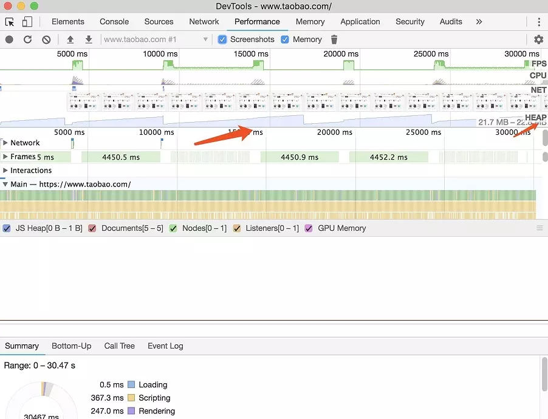
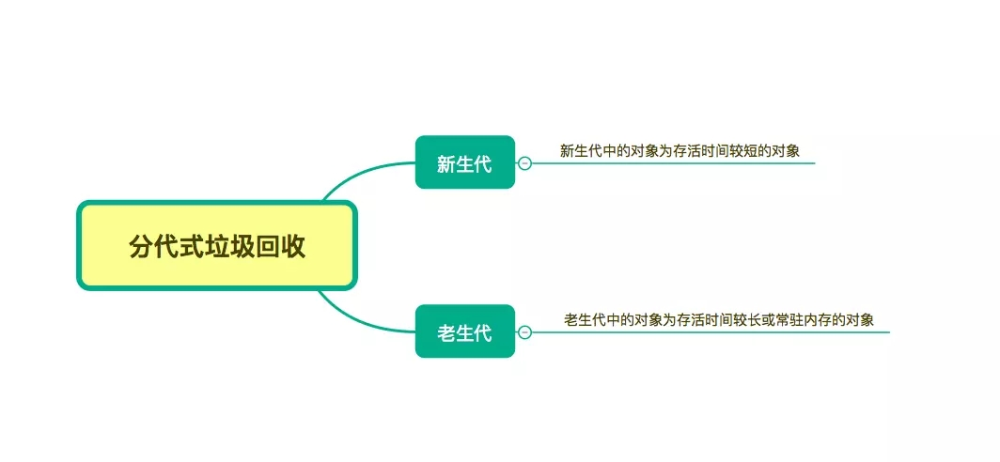
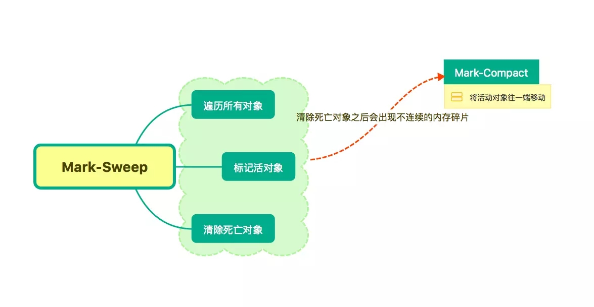

## 一、为什么要垃圾回收？
* JavaScript程序每次创建字符串、数组或对象时，内存会被动态分配，但是最终都要释放这些内存以便他们能够被再用，否则系统内存将被耗尽，造成系统崩溃。  
* JavaScript垃圾回收的机制很简单：垃圾收集器会定期（周期性）找出那些不在继续使用的变量，然后释放其内存
* 不再使用的变量也就是生命周期结束的变量，当然只可能是局部变量，全局变量的生命周期直至浏览器卸载页面才会结束。如下：
```JavaScript
function fn1() {
    var obj = {name: 'hanzichi', age: 10};
}
function fn2() {
    var obj = {name:'hanzichi', age: 10};
    return obj;
}

var a = fn1();   //obj释放
var b = fn2();  // 开辟存储obj的空间指向了全局，不被释放

// 所以闭包函数closure执行后返回的函数指向了全局，内部变量被cloFun函数所使用，内部变量不会被垃圾回收机制回收
function closure() {
  var a = 1 
  return function () {
    a++
    console.log(a)
  }
}
var cloFun = closure()
cloFun()
```

## 二、垃圾回收机制
### 1.标记清除
```JavaScript
var m = 0,n = 19 // 把 m,n,add() 标记为进入环境。
add(m, n) // 把 a, b, c标记为进入环境。
console.log(n) // a,b,c标记为离开环境，等待垃圾回收。
function add(a, b) {
  a++
  var c = a + b
  return c
}
```
### 2.引用计数
```JavaScript
function func() {
    let obj1 = {};
    let obj2 = {};

    obj1.a = obj2; // obj1 引用 obj2
    obj2.a = obj1; // obj2 引用 obj1
}
func()  //根据引用计数, obj1 和 obj2 的引用次数都不为 0，所以他们不会被回收。
```
> 当垃圾回收器下次再运行时，它就会释放那些引用次数为0的值所占用的内存
> 循环引用会造成内存泄漏
> 在IE中涉及COM对象，就会存在循环引用的问题， 由于存在这个循环引用，即使例子中的DOM从页面中移除，它也永远不会被回收。

解决循环引用的问题，最好是在不使用它们的时候手工将它们设为空。上面的例子可以这么做：

```JavaScript
obj1 = null;
obj2 = null;
```

## 三、GC解决方案
* Javascript引擎基础GC方案是（simple GC）：mark and sweep（标记清除），即：  
    遍历所有可访问的对象。
    回收已不可访问的对象。
* GC缺陷： GC时，为了安全考虑，停止响应其他操作。
* GC优化策略：   
  * 分代回收（Generation GC）  
  > 通过区分“临时”与“持久”对象；多回收“临时对象”区（young generation），少回收“持久对象”区（tenured generation），减少每次需遍历的对象，从而减少每次GC的耗时  

  * 增量GC   
  >“每次处理一点，下次再处理一点，如此类推”

## 四、内存泄漏原因与解决
 1. 意外的全局变量  (函数体内部未生命的变量、this创建的全局变量) 
   > 在js头部加上 'use strict',可避免

 2. 被遗忘的定时器或回调函数  
 3. 闭包  
```JavaScript
function bindEvent(){
  var obj=document.createElement('xxx')
  obj.onclick=function(){
    
  }
}
```
上例定义事件回调时，由于是函数内定义函数，并且内部函数--事件回调引用外部函数，形成了闭包。要解决此类问题，需要将事件处理函数定义在外部，解除闭包，或者在定义事件处理函数的外部函数中，删除对dom的引用
```JavaScript
// 将事件处理函数定义在外面
function bindEvent() {
  var obj = document.createElement('xxx')
  obj.onclick = onclickHandler    //定义外部只是变量的已用，不用再开辟空间，但此时obj未清除(dom元素的引用)
}
// 或者在定义事件处理函数的外部函数中，删除对dom的引用
function bindEvent() {
  var obj = document.createElement('xxx')
  obj.onclick = function() {
    // Even if it is a empty function
  }
  obj = null
}
```  
  4. 没有清理的dom元素  
```JavaScript
var elements = {
    button: document.getElementById('button'),
    image: document.getElementById('image'),
    text: document.getElementById('text')
};
function doStuff() {
    image.src = 'http://some.url/image';
    button.click();
    console.log(text.innerHTML);
}
function removeButton() {
    document.body.removeChild(document.getElementById('button'));
    // 此时，仍旧存在一个全局的 #button 的引用
    // elements 字典。button 元素仍旧在内存中，不能被 GC 回收。
}
```  
  5. 数组array优化 （arr.length = 0, arr = null）
  6. 对象尽量复用
  7. 在循环中的函数表达式，能复用最好放到循环外面。
  8. 使用**weakMap**  
     ```JavaScript
      const wm = new WeakMap();
      const element = document.getElementById('example');
      wm.set(element, 'some information');
      wm.get(element) // "some information"
     ```

## 五、怎样查看内存泄漏
* 打开开发者工具 Performance
* 勾选 Screenshots 和 memory
* 左上角小圆点开始录制(record)
* 停止录制


图中 Heap 对应的部分就可以看到内存在周期性的回落也可以看到垃圾回收的周期,如果垃圾回收之后的最低值(我们称为min),min在不断上涨,那么肯定是有较为严重的内存泄漏问题。

## 六、垃圾回收算法了解一下

### 分代式垃圾回收（V8主要策略）
  

### Scavenge算法
  * Scavenge算法通过牺牲空间换时间的算法非常适合生命周期短的新生代
> 它将堆内存一分为二,每一部分空间称为 semispace。 在垃圾回收的过程中, 就是通过将存活对象在两个 semispace 空间之间进行复制， 非存活将被释放  

### Mark-Sweep & Mark-Compact
> 当一个对象经过多次复制，生命周期较长的时候或则To空间不足的时候，对象会被分配到进入到老生代中，需要采用新的算法进行垃圾回收。   



Mark-Sweep 在标记阶段遍历堆中的所有对象,并标记活着的对象,在随后的清除阶段中,只清除没有被标记的对象(标记清除)  
Mark-Sweep 在进行一次标记清除回收后,内存空间会出现不连续的状态，Mark-Compact 对象在标记为死亡后,在整理的过程中,将活着的对象往一端移动,移动完成后,直接清理掉边界外的内存

### 增量标记 
垃圾回收的 3 种基本算法都需要将应用逻辑暂停下来,待执行完垃圾回收后再恢复执行应用逻辑,这种行为被称为“全停顿"  
为了降低全堆垃圾回收带来的停顿时间,V8先从标记阶段入手,将原本要一口气停顿完成的动作改为增量标记(incremental marking),**垃圾回收与应用逻辑交替执行直到标记阶段完成**