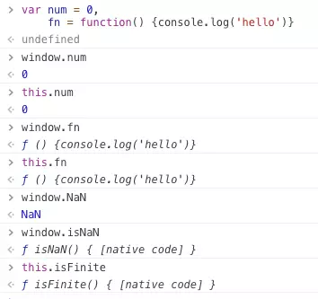
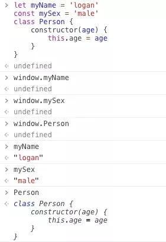

摘自[Logan70博文](https://juejin.im/post/5c0a398be51d451dcb0400b3) 如有侵权请联系删除
## 一、词法环境 （Lexical Environment）
> 词法环境就是相应代码块内标识符与值的关联关系的体现。例如函数、代码块、TryCatch中的Catch从句，并且每次执行这类代码时都会**创建新的词法环境**。
## 二、环境记录（Environment Record）
### 1. 声明式环境记录（Declarative Environment Record）  
---
声明式环境记录是用来定义那些直接将标识符与语言值绑定的ES语法元素，例如变量，常量，let，class，module，import以及函数声明等  
> 函数环境记录用于体现一个函数的顶级作用域，如果函数不是箭头函数，还会提供一个this的绑定。
### 2. 对象式环境记录（Object Environment Record）
对象可以动态添加或者删除属性，所以对象环境记录不存在不可变绑定。  
对象式环境记录用来定义那些将标识符与某些对象属性相绑定的ES语法元素，例如with语句、全局var声明和函数声明。
### 3. 全局环境记录（Global Environment Record）  
全局环境记录逻辑上来说是单个记录，但是实际上可以看作是对一个对象式环境记录组件和一个声明式环境记录组件的封装。  
> 全局环境记录的对象式环境记录组件，绑定了所有内置全局属性、全局的函数声明以及全局的var声明。所以这些绑定我们可以通过window.xx或this.xx获取到。   

 

 >全局代码的其他声明（如let、const、class等）则绑定在声明式环境记录组件内，所以这些声明我们并不能通过全局对象的属性来访问。  

 

 ## 三、 外部词法环境的引用（outer）
1.全局环境的外部词法环境引用为null。  
2.一个词法环境可以作为多个词法环境的外部环境。例如全局声明了多个函数，则这些函数词法环境的外部词法环境引用都指向全局环境。
>环境链的存在是为了标识符的解析，通俗的说就是查找变量
  
伪代码模拟一下标识符解析的过程
``` javacript
ResolveBinding(name[, LexicalEnvironment]) {
    // 如果传入词法环境为null(即一直解析到全局环境还未找到变量)，则抛出ReferenceError
    if (LexicalEnvironment === null) {
        throw ReferenceError(`${name} is not defined`)
    }
    // 首次查找，将当前词法环境设置为解析环境
    if (typeof LexicalEnvironment === 'undefined') {
        LexicalEnvironment = currentLexicalEnvironment
    }
    // 检查环境的环境记录中是否有此绑定
    let isExist = LexicalEnvironment.EnviromentRecord.HasBinding(name)
    // 如果有则返回绑定值，没有则去外层环境查找
    if （isExist） {
        return LexicalEnvironment.EnviromentRecord[name]
    } else {
        return ResolveBinding(name, LexicalEnvironment.outer)
    }
}
```
### 四、案例分析
``` javascript 
var x = 10
let y = 20
const z = 30
class Person {}
function foo() {
    var a = 10
}
foo()
```
词法分析
```
// 全局词法环境
GlobalEnvironment = {
    outer: null, // 全局环境的外部环境引用为null
    // 全局环境记录，抽象为一个声明式环境记录和一个对象式环境记录的封装
    GlobalEnvironmentRecord: {
        // 全局this绑定值指向全局对象，即ObjectEnvironmentRecord的binding object
        [[GlobalThisValue]]: ObjectEnvironmentRecord[[BindingObject]],
        // 声明式环境记录，全局除了函数和var，其他声明绑定于此
        DeclarativeEnvironmentRecord: {
            y: 20,
            z: 30,
            Person: <<class>>
        },
        // 对象式环境记录的，绑定对象为全局对象，故其中的绑定可以通过访问全局对象的属性来获得
        ObjectEnvironmentRecord: {
            // 全局函数声明和var声明
            x: 10,
            foo: <<function>>,
            // 内置全局属性
            isNaN: <<function>>,
            isFinite: <<function>>,
            parseInt: <<function>>,
            parseFloat: <<function>>,
            Array: <<construct function>>,
            Object: <<construct function>>
            // 其他内置全局属性不一一列举
        }
    }
}
// foo函数词法环境
fooFunctionEnviroment = {
    outer: GlobalEnvironment, // 外部词法环境引用指向全局环境
    FunctionEnvironmentRecord: {
        [[ThisValue]]: GlobalEnvironment, // foo函数全局调用，故this绑定指向全局环境
        // 其他函数代码内的绑定
        a: 10
    }
}
```
## 五、全局标识符解析
```
function GetGlobalBingingValue(name) {
    // 全局环境记录
    let rec = Global Environment Record
    // 全局环境记录的声明式环境记录
    let DecRec = rec.DeclarativeRecord
    // HasBinding用来检查环境记录上是否绑定给定标识符
    if (DecRec.HasBinding(name) === true) {
        return DecRec[name]
    }
    let ObjRec = rec.ObjectRecord
    if (ObjRec.HasBinding(name) === true) {
        return ObjRec[name]
    }
    throw ReferenceError(`${name} is not defined`)
}
```
> 可以看到读取全局变量时，先检索声明式环境记录，再检索对象式环境记录。
   
```JavaScript
window.age = 18
let age = 30
console.log(age)   // 30
```
## 六、应用
```JavaScript
var a = 1, b = 2 
var obj = {
  a: 3,
  b: 4,
  c: 1,
  d: 1
}
function add() {
  // console.log(this)
  console.log(a + b)
}

add() // 3
with(obj) {
  // console.log(this)
  console.log(a+b) // 7
  add(obj)  //3
  function wAdd() {
    // console.log(this.a)
    console.log(c+d)  
  }
  wAdd() // 2
}
```
> 创建新的词法环境时受outer影响，变量解析时：声明式环境记录 -> 对象式环境记录 -> 全局环境记录(outer)   
> 变量解析与this的value无关，with不会改变this指向